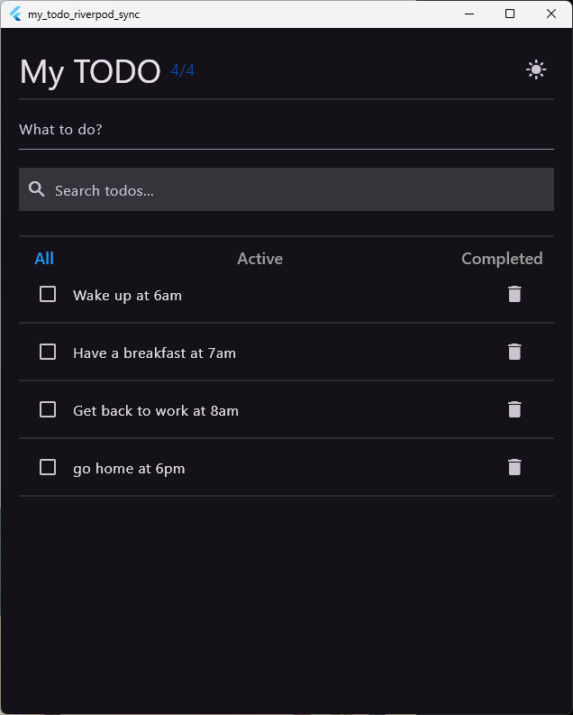

# my_todo_riverpod_sync

my todo app study of todo_riverpod_sync app from heavyfran "Synchronous Todo"

## Target Page

## Feature done

- todos page done

## TODO

- NewTodo page
- SearchTodo page
- FilterTodo page
- ShowTodos page
  